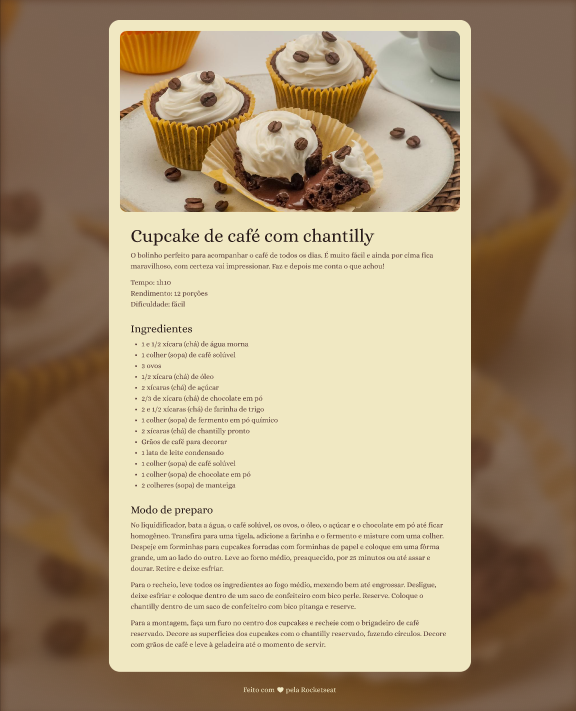

# Cooking Recipe Page
Apply basic HTML and CSS fundamentals

## How to run
Use vscode live server extension to launch a development local Server with live reload feature for static & dynamic pages. Index file on `01_web_fundamentals/projects/cooking-recipe-page/index.html`

## Material & Tools
- [Font Alice](https://fonts.google.com/specimen/Alice)
- [Figma project](https://www.figma.com/file/7M4BKqMt0jtUyPIKhDRVoM/P%C3%A1gina-de-receita-(Community)?type=design&node-id=3%3A811&mode=design&t=AGBqBFBmLjAR5VOv-1)
- [VS Code Live Server Extension](https://marketplace.visualstudio.com/items?itemName=ritwickdey.LiveServer)

### Preview
